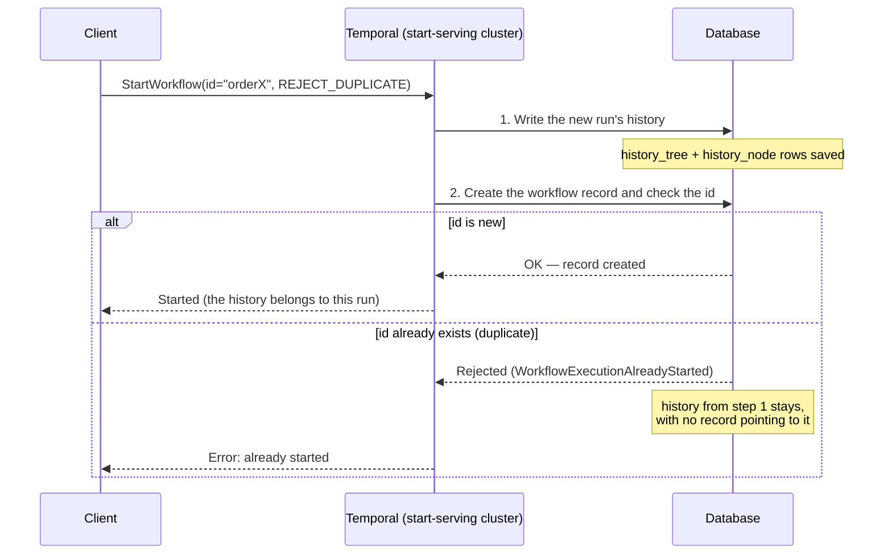

# History Growth from Duplicate Workflow Starts — Playbook

**Audience**

Operators of self-hosted Temporal clusters — single-cluster or multi-cluster, on any persistence store (SQL or Cassandra).

**Applies to**

All Temporal server versions.

**When to use**

Use this playbook when the workflow history tables — `history_node` and `history_tree` — keep growing, and the extra rows are history left behind by workflow starts that **did not create a new run**.

A start does not create a new run in one of two ways:

- **Rejected** — the caller gets an error. This comes from a workflow id reuse policy when the previous run for that id has **closed** (for example `WorkflowIDReusePolicy = REJECT_DUPLICATE`, which does not allow a new run once one has already run for that id), or from the default behavior when a run with that id is still **running** (the caller gets `WorkflowExecutionAlreadyStarted`).
- **Deduplicated** — the caller gets back the run that already exists, with no error. This comes from a client retry of the same start request (same request id), or from asking to reuse a running run (`WorkflowIDConflictPolicy = USE_EXISTING`).

Both leave history behind in the same way (explained in [Why a duplicate start leaves history behind](#why-a-duplicate-start-leaves-history-behind)).

This usually shows up when your application starts the same workflow id many times and relies on a reuse policy to keep the repeats out. That check only works while the previous run is still in the database — within the namespace's retention period. After retention deletes the previous run, the same id counts as new again, so the start is allowed and leaves nothing behind.

This playbook covers the operations that start a workflow: **StartWorkflowExecution**, **SignalWithStartWorkflowExecution** (when it has to start a new run rather than signal one that is already running), and **Update-with-Start** (`ExecuteMultiOperation`, likewise only when it has to start a new run rather than update one that is already running).

**Which cluster this affects**

The history is written by the cluster that actually **runs the start**. For a global (replicated) namespace that is the namespace's **active** cluster — and note that if a client sends the start to a passive cluster, Temporal forwards it to the active cluster, so it runs (and the history is written) there, not on the passive cluster the client connected to. For a single cluster it is simply that cluster. This leftover history is **not replicated**, so it does not show up on a standby. If your problem is a **standby** that is larger than its active, that is a different cause — see [XDC Standby Database Growth on SQL](./xdc-standby-database-growth-sql.md).

**Scope**

This playbook covers **one cause**: history left behind by rejected or deduplicated workflow starts. History can pile up for other reasons too, which are covered in the [XDC Standby Database Growth on SQL](./xdc-standby-database-growth-sql.md) playbook.

**Dashboards for this playbook**

The signals this playbook uses to detect the problem (see [Detect](#1-detect)) are all on the **[Temporal Server Dashboard](../observability/dashboards/server/temporal-server-readme.md)**, on the cluster where the namespace is active (the one that actually runs the start). Two panels to watch:

- **Server Errors by Type** (in the [Service Requests and Errors](../observability/dashboards/server/temporal-server-readme.md#5-service-requests-and-errors) row) — the `WorkflowExecutionAlreadyStarted` series is the rate of rejected duplicate starts, which is what leaves history behind.
- **Scavenger Activity — Skipped vs Handled** and **Scavenger Errors** (in the [History Scavenger](../observability/dashboards/server/temporal-server-readme.md#22-history-scavenger) row) — whether the job that clears the leftover history is running and keeping up.

---

## Contents

- [Why a duplicate start leaves history behind](#why-a-duplicate-start-leaves-history-behind)
  - [What "duplicate" means](#what-duplicate-means)
  - [Two more ways a start leaves history behind](#two-more-ways-a-start-leaves-history-behind)
  - [What does not leave history behind](#what-does-not-leave-history-behind)
- [1. Detect](#1-detect)
  - [1.1 Confirm the rate of rejected duplicate starts](#11-confirm-the-rate-of-rejected-duplicate-starts)
  - [1.2 Confirm the scavenger is falling behind](#12-confirm-the-scavenger-is-falling-behind)
  - [1.3 Confirm the leftover history in the database](#13-confirm-the-leftover-history-in-the-database)
- [2. Remediate — clear what has built up](#2-remediate--clear-what-has-built-up)
- [3. Prevent — stop it recurring](#3-prevent--stop-it-recurring)
  - [Server-side start limits, and what each does to leftover history](#server-side-start-limits-and-what-each-does-to-leftover-history)
- [Related](#related)

---

## Why a duplicate start leaves history behind

First, some background on what a duplicate start even is. Inside a namespace, a workflow id is meant to point to one workflow. Temporal enforces this with two rules:

- Only **one run with a given workflow id can be running at a time.** You cannot have two live workflows sharing the same id in the same namespace.
- You choose whether a **new** run is allowed for an id that was **used before**, once the earlier run with that same workflow id has finished.

Temporal checks these rules on every start — the exact policies that decide each case are laid out in [What "duplicate" means](#what-duplicate-means) below. When a rule says the start is not allowed, Temporal turns it away — either **rejected** or **deduplicated**, the two outcomes described under **When to use** above. Turning starts away is a normal, wanted feature. The leftover history is not caused by the turning-away itself — it comes from the **order** in which Temporal does the work, which the rest of this section explains.

When you start a workflow, Temporal does two things, in this order:

1. It **writes the new run's history** (rows in `history_tree` and `history_node`).
2. It then **creates the workflow's record and checks whether the workflow id is already in use.**

These two steps are separate. The history in step 1 is saved before the check in step 2 runs, and step 1 is not undone if step 2 fails.

So when the workflow id is already in use and the start is turned away, step 1 has already written a fresh history, but step 2 created no workflow record. That history is now left behind, with nothing pointing to it. The normal cleanup that removes a workflow's history follows the workflow record — and there is no record here, so it never applies. This is the same whether the start was **rejected** or **deduplicated**: in both, the history was written before Temporal decided the start could not create a new run.

The **deduplicated** case is the less obvious one. Even though the caller gets back the run that already exists, Temporal still tried to create a new run first — step 1 wrote the history — and only then found the id was taken and returned the existing run. The history it wrote is left behind, just like a rejected start.

**What a leftover actually is:** just the start of a history — one row in `history_tree` and one in `history_node` — holding the workflow's first two events: `WorkflowExecutionStarted` (which carries the input you passed) and `WorkflowTaskScheduled`. The workflow never ran, so there is nothing more. Each is small (a larger input makes it bigger), but one is left for every duplicate start, so at a high rate they add up.

Only these two tables grow this way. No workflow record was written, so the `executions` table is not affected — if `executions` is also growing, the cause is different (see [Related](#related)).

**This is normally cleaned up on its own.** Temporal runs a background job — the **history scavenger** — that finds history whose workflow is gone and removes it. It runs on a delay and skips recent history, so it is not immediate. The problem this playbook covers is when duplicate starts pile up faster than the scavenger clears them, and the history tables keep growing.

The diagram below follows one start through these two steps, for both outcomes. When the id is new, the run is created and keeps the history from step 1. When the id is a duplicate, the start is turned away in step 2 — but the history from step 1 is already saved, so it stays behind with no workflow to own it.



### What "duplicate" means

A duplicate start means calling StartWorkflow with a workflow id that **already has a run**. What happens — and whether it leaves history behind — depends on two things: whether that previous run has **closed** or is still **running**, and which policy you set for that case.

- If the previous run has **closed**, your **workflow id reuse policy** decides.
- If the previous run is still **running**, your **workflow id conflict policy** decides.

The underlying reason is the same in every row below: a start writes its history *before* the server checks the id, so you get a leftover whenever your start is **rejected**, **deduplicated**, or **replaced by a brand-new run**. You get **no** leftover only when your start itself **becomes the surviving run**.

**Previous run has closed — the workflow id reuse policy decides:**

| Reuse policy | What happens to your start | Leftover? |
|---|---|---|
| `ALLOW_DUPLICATE` (default) | Created — becomes the new run | **No** |
| `ALLOW_DUPLICATE_FAILED_ONLY`, previous run ended unsuccessfully | Created — becomes the new run | **No** |
| `ALLOW_DUPLICATE_FAILED_ONLY`, previous run completed successfully | Rejected — caller gets `WorkflowExecutionAlreadyStarted` | **Yes** |
| `REJECT_DUPLICATE` | Rejected — caller gets `WorkflowExecutionAlreadyStarted` | **Yes** |

These reuse-policy outcomes apply **only when the previous run has closed.** While a run with that id is still **running**, the reuse policy is not consulted at all — the conflict policy decides instead. So even `ALLOW_DUPLICATE` does **not** start a second run while one is already running: the default conflict policy (`FAIL`) rejects it, as in the next table.

**Previous run is still running — the workflow id conflict policy decides:**

| Conflict policy | What happens to your start | Leftover? |
|---|---|---|
| `FAIL` (server default) | Rejected — caller gets `WorkflowExecutionAlreadyStarted` | **Yes** |
| `USE_EXISTING` | Deduplicated — caller gets the running run back | **Yes** |
| `TERMINATE_EXISTING` (or the older reuse policy `TERMINATE_IF_RUNNING`) | Ends the running run and creates a new one | **Yes** |

`FAIL` is the **server's** default — what the server applies when a start arrives without a conflict policy set (a plain StartWorkflow that doesn't specify one lands here). But the conflict policy is chosen by the caller, and an SDK or a specific start API may set its own value before the request reaches the server. So if you don't set it explicitly, check what your SDK sends rather than assuming `FAIL`.

A few things worth pulling out of the tables:

- **Only two outcomes leave nothing behind** — the ones where your start becomes the running workflow: `ALLOW_DUPLICATE` on a closed run, and `ALLOW_DUPLICATE_FAILED_ONLY` on a run that ended unsuccessfully. Every other outcome leaves history behind.
- **`REJECT_DUPLICATE` leaves the most,** because it turns away *every* repeat.
- **The default `ALLOW_DUPLICATE` is not safe against repeats while a run is still going.** `ALLOW_DUPLICATE` only decides the closed-run case; a repeat sent while the run is still active is handled by the conflict policy, which rejects by default. So even with the default settings, hammering the same id while it runs leaves history behind.

### Two more ways a start leaves history behind

The reuse and conflict policies above are the main causes, but two other things can turn a start away *after* its history is written:

- **An automatic retry of a start whose reply was lost.** Every start carries a request id. If the server creates the run but the network drops the reply on the way back, the client's SDK retries the *same* request (same request id). The server recognizes the id and does not create a second run — it returns the one it already made — but that retry attempt wrote its own history first, so a leftover remains. (This is the SDK retrying automatically, not an end user clicking twice — two clicks would be two different requests, which the policies above handle.)
- **An optional server throttle on rapid repeat starts.** A setting called `history.enableWorkflowIdReuseStartTimeValidation` (off by default) makes the server reject a start if the same id was started again too quickly — within about a second of the last one. Operators sometimes turn it on to protect a **hot shard** (one workflow id being started over and over); see the [Hot Shard playbook](./hot-shard-detection-remediation.md). As with the cases above, a start it rejects has already written its history, so it leaves a leftover.

### What does not leave history behind

A start leaves history behind only when the history was already written and *then* the workflow record could not be created. A start that is stopped **before** the history is written leaves nothing. In particular, **rate-limit rejections do not cause this problem:**

- A start rejected by a **rate limit** — the frontend request limit (`frontend.rps`, `frontend.globalRPS`, `frontend.namespaceRPS`), the history service limit, or a persistence limit (`history.persistencePerShardNamespaceMaxQPS` and the other persistence QPS limits) — is turned away with a "resource exhausted" error **before** the request reaches the point where history is written. Nothing is left behind.
- This holds even under heavy retrying: each retry is turned away before the history write as well, so no leftover history builds up no matter how many times the caller retries.

So "resource exhausted" on a start is not a sign of this problem. The leftover comes specifically from the duplicate-id checks in the table above.

---

## 1. Detect

This has three checks. **[1.1](#11-confirm-the-rate-of-rejected-duplicate-starts)** measures how fast starts are being **rejected** as duplicates — a leading signal, but it does not see *deduplicated* starts. **[1.2](#12-confirm-the-scavenger-is-falling-behind)** and **[1.3](#13-confirm-the-leftover-history-in-the-database)** look at the leftover history itself, so they catch it no matter which kind of start caused it.

### 1.1 Confirm the rate of rejected duplicate starts

On the cluster where the namespace is active (the one that runs the start), check how often starts are being rejected as duplicates. On the **[Temporal Server Dashboard](../observability/dashboards/server/temporal-server-readme.md#5-service-requests-and-errors)**, open the **Server Errors by Type** panel and look for the `WorkflowExecutionAlreadyStarted` series.

To query it directly:

```promql
sum(rate(service_error_with_type{service_name="frontend", error_type=~".*WorkflowExecutionAlreadyStarted"}[5m]))
```

A steady, high rate here means many starts are being **rejected** as duplicates — each one leaves history behind. On the default (tally) Prometheus reporter the `error_type` value shows as `serviceerror_WorkflowExecutionAlreadyStarted` (dots in the type name become underscores); the query above matches it by suffix, so it works either way.

Two things to keep in mind reading this:

- **Read the `frontend` count only.** The same rejections are also recorded under `service_name="history"` one layer deeper — often with bigger numbers, because of internal retries — so filter to `frontend` and don't add the two together.
- **This counts *rejected* starts, not *deduplicated* ones.** A rejection returns an error, which is what this metric records — even when the client hides it (the `temporal` CLI, for example, can print the existing run and exit 0 while the server still recorded the rejection). A *deduplicated* start (conflict policy `USE_EXISTING`, or an automatic same-request-id retry) returns the existing run with **no error**, so it does **not** appear here. If deduplication is your main source of leftovers, this panel under-counts — rely on the scavenger and database checks below ([1.2](#12-confirm-the-scavenger-is-falling-behind), [1.3](#13-confirm-the-leftover-history-in-the-database)).

### 1.2 Confirm the scavenger is falling behind

The leftover history is cleared only by the history scavenger. On the **[Temporal Server Dashboard](../observability/dashboards/server/temporal-server-readme.md#22-history-scavenger)**, open the **History Scavenger** row and check that the scavenger is running and not erroring (the **Scavenger Errors** panel should sit near zero). If it is running cleanly but the history tables still grow, it is being outpaced by the rate of new duplicates from [1.1](#11-confirm-the-rate-of-rejected-duplicate-starts).

### 1.3 Confirm the leftover history in the database

Confirm that the history tables hold history with no matching workflow record. On SQL persistence, the count-leftover-history-branches query does exactly this — see [Count leftover history branches](./xdc-standby-database-growth-sql.md#14-count-leftover-history-branches-the-history-gap) and [Compare branches per workflow](./xdc-standby-database-growth-sql.md#15-compare-branches-per-workflow-the-history-gap). Run it on the active cluster; a high count of history with no workflow record confirms this cause.

On Cassandra the same idea holds, but the SQL queries do not apply (a Cassandra-specific version is planned). Rely on the metrics in [1.1](#11-confirm-the-rate-of-rejected-duplicate-starts) and [1.2](#12-confirm-the-scavenger-is-falling-behind) there.

---

## 2. Remediate — clear what has built up

The scavenger is the only tool that can remove this history. There is no workflow record, so a per-workflow delete (`tdbg workflow delete`, the delete API) has nothing to point it at — it cannot find this history. Do not try to delete `history_tree` / `history_node` rows by hand; you can delete a live workflow's history that way.

By default the scavenger waits until history is 60 days old before it will remove it, so leftovers can sit for weeks. Lower the wait so it clears them promptly:

```yaml
worker.historyScannerDataMinAge:
  - value: "1h"
```

The scavenger runs about every 12 hours, so a change takes effect on its next scan, not immediately. For how to check when the next scan runs and how to trigger one sooner, see [Keep the scavenger's wait short enough](./xdc-standby-database-growth-sql.md#32-keep-the-scavengers-wait-short-enough-the-history-gap).

Lowering the wait clears the backlog, but it does not stop new leftovers arriving. If duplicates keep coming in faster than the scavenger clears them, you also need [Prevent](#3-prevent--stop-it-recurring).

---

## 3. Prevent — stop it recurring

The real fix is to **stop issuing starts that will be rejected.**

**Don't rely on `REJECT_DUPLICATE` for high-volume deduplication.** It has two problems:

- It leaves history behind on **every** rejected start (the cause above).
- Its deduplication is **time-limited by retention.** It only prevents a repeat while the original workflow still exists; once the namespace's retention period deletes that workflow, the same id is no longer seen as a duplicate and a new start is allowed. So it deduplicates only within the retention window, not indefinitely.

Better options are app-side:

- **Deduplicate before you call StartWorkflow.** Keep your own persistent record of which ids you have already handled, and skip the start for ones you have. No start is issued for a known duplicate, so no history is left behind, and it works beyond the retention window.
- **Alternative (use with care) — give each start a unique id and check for duplicates after it starts.** A unique (or server-assigned) id never collides, so nothing is rejected and nothing is left behind. But this creates a real workflow for *every* start, duplicates included — usually running an activity to do the check — so at a high duplicate rate it just moves the pressure onto your database and workers. Not a fit for high-volume deduplication; prefer the pre-start check above.

The same idea applies to the other ways duplicates show up:

- **If you restart the same id in a loop** (`TERMINATE_IF_RUNNING`, or fail-then-retry), a leftover per restart is unavoidable on the server side. Here is where it comes from: when the id is already running, the server writes the history for the new run it is about to create, *then* finds the id in use, and to resolve it terminates the old run and creates the replacement under a **fresh, different run id**. The history it wrote in that first step is now under a run id it abandoned, so it is left behind. (The terminated old run keeps its own record and history — that is not the leftover.) If the restarts are really *one continuing job*, use `continue-as-new` or a signal to the running workflow instead; if you genuinely need separate runs, keep the scavenger tuned (below).
- **If you repeatedly start an id while its run is still going**, every extra attempt leaves a leftover, no matter the conflict policy (reject, use-existing, and terminate-existing all leave one). The fix is to stop sending the extra starts, not to change the policy.

> **Avoid `TERMINATE_IF_RUNNING` (and the conflict policy `TERMINATE_EXISTING`) as a general pattern.** Beyond the leftover history, terminating stops the running workflow **immediately and does not let its code run any cleanup or compensation** — unlike a workflow **cancel** (the `RequestCancelWorkflowExecution` request a client sends, exposed as `CancelWorkflow` in the SDKs), which the workflow can catch and handle. The workers running that workflow are not given a chance to wind it down, so terminating mid-flight can leave business-level work half-done. Reach for it only when a hard, unconditional stop is truly what you want.

Keep the scavenger's wait low (as in [Remediate](#2-remediate--clear-what-has-built-up)) as a safety net, but treat it as the backstop, not the fix.

### Server-side start limits, and what each does to leftover history

Temporal has two optional server settings for slowing down rapid repeat starts of the same workflow id. Their real purpose is **load protection** — capping how fast one workflow id can be started so it can't overwhelm a shard (see the [Hot Shard playbook](./hot-shard-detection-remediation.md)); neither is meant to clean up leftover history. Still, since both act on the start path, it helps to know what each one does to leftovers. What matters is **when it stops the repeat start:** before or after that start has written its history.

| Dynamic config | When it stops a repeat start | What it leaves behind |
|---|---|---|
| **None set** — the default | Nothing stops it early; only the workflow-id check stops it, and that runs **after** the history is written. | Each stopped start leaves its history behind. |
| `history.enableWorkflowIdReuseStartTimeValidation` — the **older** option (off by default; when on, it applies `history.workflowIdReuseMinimalInterval`, default 1 second) | **After** the history is written. And the rejection is an error the client automatically retries, so each retry writes history again. | Leaves history behind — and *more* of it once retries pile up. |
| `history.businessIDReuseRate` — from **1.32.0**, the newer replacement for the older setting above (a number of starts per second; `0` = off, the default) | **Before** any history is written. | A stopped start writes nothing. But blocked callers retry, and the few retries the limit lets through each second do write history — so it reduces leftovers, it does not eliminate them. |

`history.businessIDReuseRate` is a rate limit with a burst allowance, not a hard block: a companion setting, `history.businessIDReuseBurstRatio` (default equal to the rate), lets a small burst of starts through before the limit takes hold. That burst, plus the retries mentioned above, is why it lowers the leftover count but does not drive it to zero.

You can't say one of these is simply better or worse than another, because how much history each one leaves depends on **what your workload was doing.** Two scenarios show the difference:

**Example 1 — a burst of starts for the same id at once (the common case).** Say **10 starts** for one id arrive together: one wins and creates the run, and the other **9** are duplicates. With no setting, each of those 9 is rejected by the id check *after* writing history, so each leaves a leftover.

| Dynamic config | Leftovers from the 10-start burst |
|---|---|
| None set | 9 |
| `enableWorkflowIdReuseStartTimeValidation` (older) | 9 — no change (does not apply here; see below) |
| `businessIDReuseRate` = 1 per second | 3–4 |

Because the starts were already being rejected, moving the check *earlier* (`businessIDReuseRate`) is a clear win. The older setting makes no difference here: when the existing run is still going, these starts are handled by the conflict policy and never reach the older setting's check.

**Example 2 — rapid restarts of the same id, with the workflow id reuse policy set to `TERMINATE_IF_RUNNING`.** Say a run is going and **10 restarts** arrive in quick succession. With no setting, each restart *succeeds* — it ends the running workflow and starts a fresh one — so each leaves one leftover branch (and no errors).

| Dynamic config | Leftovers from 10 rapid restarts |
|---|---|
| None set | 10 |
| `enableWorkflowIdReuseStartTimeValidation` (older) | ~42 |
| `businessIDReuseRate` = 1 per second | ~38 |

Here both settings make it **worse** — even worse than doing nothing. Here is why the numbers go *above* 10. With no setting, each restart simply succeeds, so there is no error and no retry: 10 restarts, 10 leftovers. Turn on either setting and the restart is instead rejected with a **"resource exhausted"** error — the throttle's way of saying "too soon" or "over the limit." SDKs automatically retry that error, so each of the 10 restarts is sent many times over. Every attempt that reaches the create step writes its history first, so the leftover count climbs well past 10. (`businessIDReuseRate` blocks some attempts before the write, but on this restart path enough still get through and are retried that it barely helps.)

**What to take from this:**

- `history.businessIDReuseRate` (1.32.0) helps only when your starts were already being rejected (like Example 1) — and even then it just lowers the leftovers, never to zero. Where your starts were succeeding (like Example 2), it does not help, and can make things worse: it turns those successful starts into retried errors, which write even more history.
- The older `history.workflowIdReuseMinimalInterval` does not reduce leftover history in either case, and makes it worse when callers retry. It is off by default; there is no reason to turn it on for this problem.
- Neither setting changes the reuse-policy rejections (`REJECT_DUPLICATE` and the others), which still write history first.
- **You can't spot these cases from the error metrics.** The rejected-start metric ([1.1](#11-confirm-the-rate-of-rejected-duplicate-starts)) does not catch them — a plain terminate restart *succeeds* (no error at all), and a throttled one shows up only as a generic **"resource exhausted"** error, which lumps together causes that leave history behind (the older `BusyWorkflow` throttle) with causes that do not (plain frontend or persistence rate limits, and even `businessIDReuseRate`'s own rejections, which block before the write). So don't diagnose this from error counts. Detect it the reliable way — watch the leftover history itself with the scavenger and database checks, [1.2](#12-confirm-the-scavenger-is-falling-behind) and [1.3](#13-confirm-the-leftover-history-in-the-database).

**Bottom line:** to actually stop leftover history, use the [app-side prevention above](#3-prevent--stop-it-recurring). These server settings still have their place — load protection for a hot workflow id — but don't count on them to fix leftover history: they only change how fast it arrives, and one of them speeds it up.

---

## Related

- **[XDC Standby Database Growth on SQL](./xdc-standby-database-growth-sql.md)** — for a **standby** cluster that has grown larger than its active. That covers the other ways history is left behind (deletes that fail under database stress, deletes never replicated to the standby, rows deleted by hand) and the SQL steps to detect and clear them.
- **History Scavenger errors alert** — the optional `temporal-alert-085` (History Scavenger Errors) applies here too; see the [alert index](../observability/alerts/server/alerts-index.md#alert-85--history-scavenger-errors).
